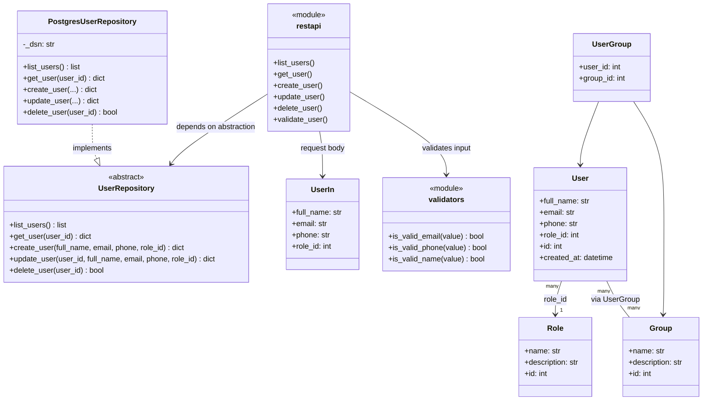

# C4 Code diagram: Users API

```mermaid
classDiagram
    class UserRepository {
        <<abstract>>
        +list_users() list
        +get_user(user_id) dict
        +create_user(full_name, email, phone, role_id) dict
        +update_user(user_id, full_name, email, phone, role_id) dict
        +delete_user(user_id) bool
    }
    class PostgresUserRepository {
        -_dsn: str
        +list_users() list
        +get_user(user_id) dict
        +create_user(...) dict
        +update_user(...) dict
        +delete_user(user_id) bool
    }
    class UserIn {
        +full_name: str
        +email: str
        +phone: str
        +role_id: int
    }
    class restapi {
        <<module>>
        +list_users()
        +get_user()
        +create_user()
        +update_user()
        +delete_user()
        +validate_user()
    }
    class validators {
        <<module>>
        +is_valid_email(value) bool
        +is_valid_phone(value) bool
        +is_valid_name(value) bool
    }
    class User {
        +full_name: str
        +email: str
        +phone: str
        +role_id: int
        +id: int
        +created_at: datetime
    }
    class Role {
        +name: str
        +description: str
        +id: int
    }
    class Group {
        +name: str
        +description: str
        +id: int
    }
    class UserGroup {
        +user_id: int
        +group_id: int
    }

    PostgresUserRepository ..|> UserRepository : implements
    restapi --> UserRepository : depends on abstraction
    restapi --> UserIn : request body
    restapi --> validators : validates input
    User "many" --> "1" Role : role_id
    User "many" -- "many" Group : via UserGroup
    UserGroup --> User
    UserGroup --> Group
```